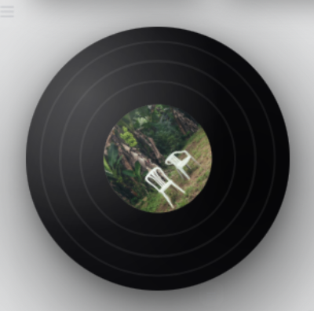

# now-playing

> The current track as a tilted, continuously spinning vinyl record.

[](https://github.com/jke48222/now-playing-widget/releases/latest) [](LICENSE) 

[Übersicht gallery](https://tracesof.net/uebersicht-widgets/) · [Widget suite](https://github.com/jke48222/widget-suite) · [Download](https://github.com/jke48222/now-playing-widget/releases/latest) · [Setup guide](docs/SETUP.md) · [Troubleshooting](docs/TROUBLESHOOTING.md)

A widget for [Übersicht](http://tracesof.net/uebersicht/), self-contained in
`index.jsx`. It auto-detects the active player — **Spotify or the macOS Music
app** — via AppleScript (whichever is playing wins). Spotify needs no setup: its
cover art comes straight from AppleScript. For the Music app, connect the Apple
Music (MusicKit) API (below) for correct artwork and account-wide now-playing
(e.g. playback on your iPhone).



### On the desktop

The widget running alongside the full set:


[Full-resolution video](media/homescreen.mp4)

## Requirements

- macOS with [Übersicht](https://tracesof.net/uebersicht/) installed (`brew install --cask ubersicht`)
- Optional: Apple Music / MusicKit (see below)

## Install

If you don't have Übersicht yet:

```sh
brew install --cask ubersicht
```

**One-click.** Clone the repo and run the installer. It copies the widget into Übersicht's widgets folder, installs any helper scripts, and runs setup if the widget needs it. Safe to re-run.

```sh
git clone https://github.com/jke48222/now-playing-widget.git
cd now-playing-widget && ./install.sh
```

**Manual.** Download `now-playing.widget.zip` from the [latest release](https://github.com/jke48222/now-playing-widget/releases/latest), unzip it, and put the `now-playing.widget` folder in `~/Library/Application Support/Übersicht/widgets/`. Then refresh Übersicht (menu bar icon → Refresh All).

With no setup: Spotify works fully (cover from AppleScript), and the Music app
shows the track with its cover resolved via the public iTunes Search API
(best-effort). The MusicKit setup below only improves Music-app artwork.

Blank widget? Run `./check.sh` for a pass/fail diagnosis, or see [docs/TROUBLESHOOTING.md](docs/TROUBLESHOOTING.md).

## Connect to Apple Music / MusicKit (optional, Music app only)

For the Music app, a local helper can call the Apple Music API to (a) fetch the
correct catalog artwork for the playing track and (b) surface account-wide
now-playing when the Mac itself is idle. When the helper is absent it falls back
to the iTunes Search API, so this step is optional. (Spotify does not use this.)

1. Create the config directory and copy the helpers:
   ```sh
   mkdir -p ~/.config/widgetsuite
   cp setup/musickit-fetch.py setup/musickit-setup.sh ~/.config/widgetsuite/
   ```
2. In the [Apple Developer portal](https://developer.apple.com/account) create a
   **MusicKit identifier** and a **private key (.p8)**, then place:
   ```sh
   #  ~/.config/widgetsuite/musickit.p8     (the downloaded private key)
   #  ~/.config/widgetsuite/musickit.json   {"keyId": "ABC123DEF4", "teamId": "TEAMID1234"}
   ```
3. Authorize Apple Music to get a Music User Token:
   ```sh
   bash ~/.config/widgetsuite/musickit-setup.sh
   # authorize, then paste the token into:
   #  ~/.config/widgetsuite/musickit-user-token.txt
   ```
4. Refresh Übersicht.

Your `.p8`, tokens, and `musickit.json` stay on your machine and are never
committed (see `.gitignore`). An Apple Developer Program membership is required.

Note: `index.jsx` also checks an optional MediaRemote snapshot at
`~/.config/widgetsuite/now-playing-state.json` (a JSON file you could have your
own companion write for system-accurate artwork; none is included). If that file
does not exist, the widget simply skips it — no action needed.

## Customization

- Cover-art lookup order: the command string in `index.jsx`.
- Spin speed / sizing: the constants and styles in `index.jsx`.
- All styling is in the inlined design-system block at the top of `index.jsx`.

## Bundled files

- `now-playing.widget/index.jsx` — the widget
- `setup/musickit-fetch.py` — optional Apple Music helper (no keys included)
- `setup/musickit-setup.sh` — one-time MusicKit authorization helper
- `install.sh` / `install.command` — one-click installer (copies the widget into Übersicht and installs any helpers)
- `check.sh` — read-only setup diagnostics; prints pass/fail per item

## Related widgets

Part of the [Übersicht Widget Suite](https://github.com/jke48222/widget-suite): 12 widgets that share one design system.

- [Animated Wallpaper](https://github.com/jke48222/animated-wallpaper-widget)
- [Clipboard History](https://github.com/jke48222/clipboard-history-widget)
- [Daily AI Prompt](https://github.com/jke48222/daily-ai-prompt-widget)
- [Daily Astronomy Photo](https://github.com/jke48222/daily-astronomy-photo-widget)
- [Daily Tarot](https://github.com/jke48222/daily-tarot-widget)
- [GitHub Contributions](https://github.com/jke48222/github-contributions-widget)
- [Recent Album Covers](https://github.com/jke48222/recent-album-covers-widget)
- [Recent Downloads](https://github.com/jke48222/recent-downloads-widget)
- [Rotating 3D Model](https://github.com/jke48222/rotating-3d-model-widget)
- [Spinning Globe](https://github.com/jke48222/spinning-globe-widget)
- [Wallpaper Switcher](https://github.com/jke48222/wallpaper-switcher-widget)

## License

MIT. See [LICENSE](LICENSE).

## Author

Jalen Edusei <jalen.edusei@gmail.com>
